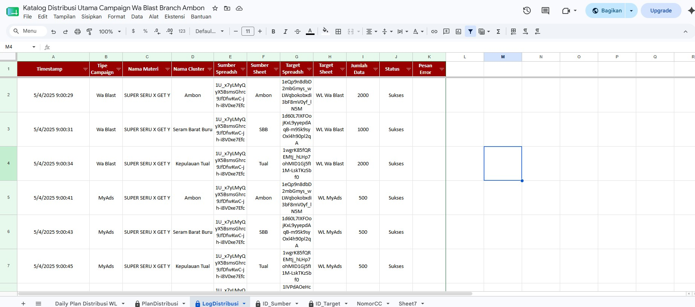
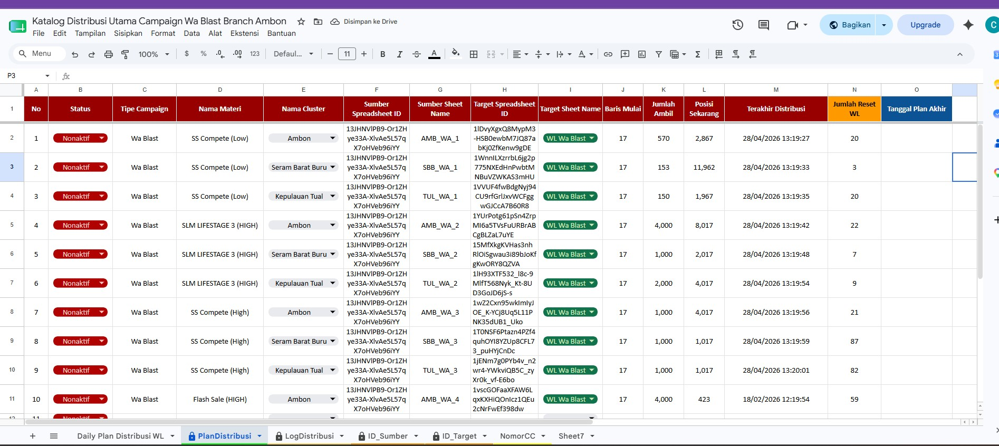

# 🚀 Automated Data Distribution System

Automated data distribution system built using **Google Apps Script** and **Google Sheets** to streamline WhatsApp campaign management, customer segmentation, and campaign distribution processes.

---

## 📋 Overview

This project automates the distribution of campaign data across multiple operational areas, reducing manual workload, improving accuracy, and accelerating campaign execution.

The system automatically:

- Extracts Spreadsheet IDs from campaign links.
- Maps campaign materials to designated operational areas.
- Distributes customer (MSISDN) data into target spreadsheets.
- Generates distribution logs for monitoring and tracking.
- Supports multi-area campaign execution.

Developed as a real-world operational automation solution for telecommunications campaign management.

---

## 🛠 Technologies Used

- Google Apps Script
- JavaScript
- Google Sheets
- Google Drive
- SpreadsheetApp API

---

## ✨ Key Features

### 🔗 Automated Link Processing

- Automatically extracts Spreadsheet IDs from Google Sheets URLs.
- Eliminates manual ID extraction.
- Validates campaign source links.

### 📊 Customer Data Distribution

- Automatically distributes customer data into destination campaign sheets.
- Supports bulk processing.
- Reduces manual copy-paste activities.

### 🗂 Campaign Management

Supports multiple campaign categories:

- Flash Sale (High)
- Flash Sale (Low)
- SS Compete (High)
- SS Compete (Low)
- SLM Lifestage 3

### 🌍 Area-Based Segmentation

Distribution can be executed based on operational areas:

- Ambon
- Seram Bagian Barat (SBB)
- Kepulauan Tual

### 📝 Distribution Logging

- Automatic activity logging.
- Distribution history tracking.
- Easier monitoring and auditing.

---

## 🔄 Workflow

```text
Campaign Link Input
        │
        ▼
Spreadsheet ID Extraction
        │
        ▼
Campaign Mapping
        │
        ▼
Customer Data Distribution
        │
        ▼
Distribution Log Generation
        │
        ▼
Campaign Ready for Execution
```

---

## 📸 Workflow Overview



---

## 📸 Distribution Result



---

## 📁 Project Structure

```text
automated-data-distribution-system/
│
├── Documentation/
│   └── Project_Documentation.md
│
├── Screenshots/
│   ├── Workflow_Overview.jpg
│   └── Distribution_Result.jpg
│
├── Source_Code/
│   └── Code.gs
│
└── README.md
```

---

## 📈 Benefits

### Before Automation

- Manual campaign distribution.
- Repetitive copy-paste processes.
- Higher risk of human error.
- Time-consuming execution.

### After Automation

- Faster campaign preparation.
- Automated data processing.
- Consistent execution workflow.
- Improved operational efficiency.

---

## 📚 Documentation

Detailed documentation is available here:

➡️ [Project Documentation](Documentation/Project_Documentation.md)

---

## 👨‍💻 Author

**Reza Ikhy**

- Full Stack Web Development Graduate
- Automation & Data Processing Enthusiast
- Google Apps Script Developer
- Virtual Assistant Trainee

GitHub:

https://github.com/rezaikhy

---

## 🎯 Portfolio Highlights

This project demonstrates:

- Business Process Automation
- Google Apps Script Development
- Data Processing
- Spreadsheet Automation
- Operational Workflow Optimization
- Documentation Skills
- Problem Solving

---

## ⚠️ Disclaimer

All sensitive information, customer data, phone numbers, internal URLs, and company-specific identifiers have been removed or anonymized.

This repository is published solely for portfolio and educational purposes.
